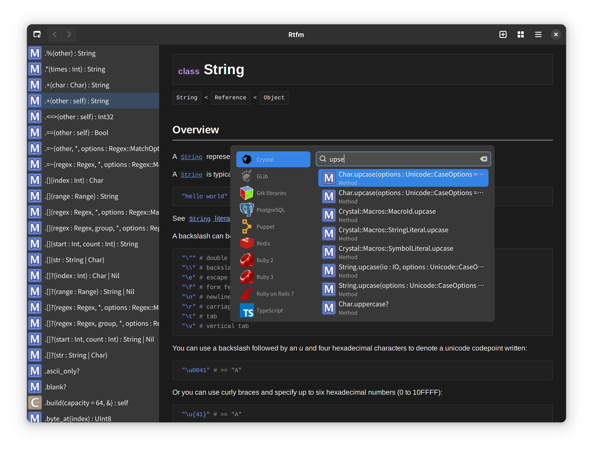

# Read the Formidable Manual

It's a dash/docset reader with built in documentation for Crystal and GTK
APIs. It's written in [Crystal](https://crystal-lang.org/) using
[GTK4 bindings](https://github.com/hugopl/gtk4.cr).



Tasks needed to be done before I ask anyone to use this:

- [ ] Refactor Fzy API to remove some bad and slow stuff I wrote just to have something working.
- [ ] Add UI to download docset.
- [ ] Have a nice set of icons.
- [ ] Have button/shortcut to enable/disable fuzzy search.
- [ ] Ubuntu package.

## Installation

## ArchLinux

There's a AUR package, it's named `gnome-rtfm` because there's already a `rtfm` package there for another project.

```
yay -S gnome-rtfm
```

## Ubuntu

Waiting for you to submit a package 😉️.

## Nix
### The easiest way to install package

Install `nix` package manager:
```bash
sh <(curl -L https://nixos.org/nix/install) --daemon
```

Add `unstable` channel:
```bash
nix-channel --add https://nixos.org/channels/nixpkgs-unstable unstable
nix-channel --update
```
Install `rtfm` package:
```bash
nix-env -iA unstable.rtfm
```
Run:
```bash
rtfm
```
### The best way to install package
If you want the best experience and all the features of nix, you need to follow a few steps described in [this](https://github.com/sund3RRR/nix-on-generic-linux) repository.

## Flatpak

Not on flathub yet, but you can build the package by doing:

```
$ flatpak-builder ./build ./data/io.github.hugopl.rtfm.json --user --install --force-clean
$ flatpak run io.github.hugopl.rtfm
```

## Compiling from source

Dependencies:

- [Crystal compiler](https://github.com/crystal-lang/crystal).
- [Shards dependency manager](https://github.com/crystal-lang/shards).
- [SQLite3](https://sqlite.org/index.html).
- [GTK4](https://www.gtk.org/)
- [GTK Webkit-6.0](https://webkitgtk.org/)
- [GObject-introspection](https://gi.readthedocs.io/en/latest/) packages for all GTK related dependencies.
- Offline crystal api documentation for Crystal docset generation.
- Offline Gtk api documentation for Gtk4, Gdk4, Gsk4, libAdwaita and Pango libraries for GTK4 libraries docset generation.

There are no packages for any distro yet.

```
$ make
$ make install
```

Then you need to run some commands to let Gnome Shell update the application cache and start show Rtfm, but
if you don't remember these commands, just reinstall some Gnome application like gnome-calculator and it's done 😅️.

You can uninstall it later with:

```
$ make uninstall
```

## Contributing

1. Fork it (<https://github.com/hugopl/rtfm/fork>)
2. Create your feature branch (`git checkout -b my-new-feature`)
3. Commit your changes (`git commit -am 'Add some feature'`)
4. Push to the branch (`git push origin my-new-feature`)
5. Create a new Pull Request

## Contributors

- [Hugo Parente Lima](https://github.com/hugopl) - creator and maintainer
