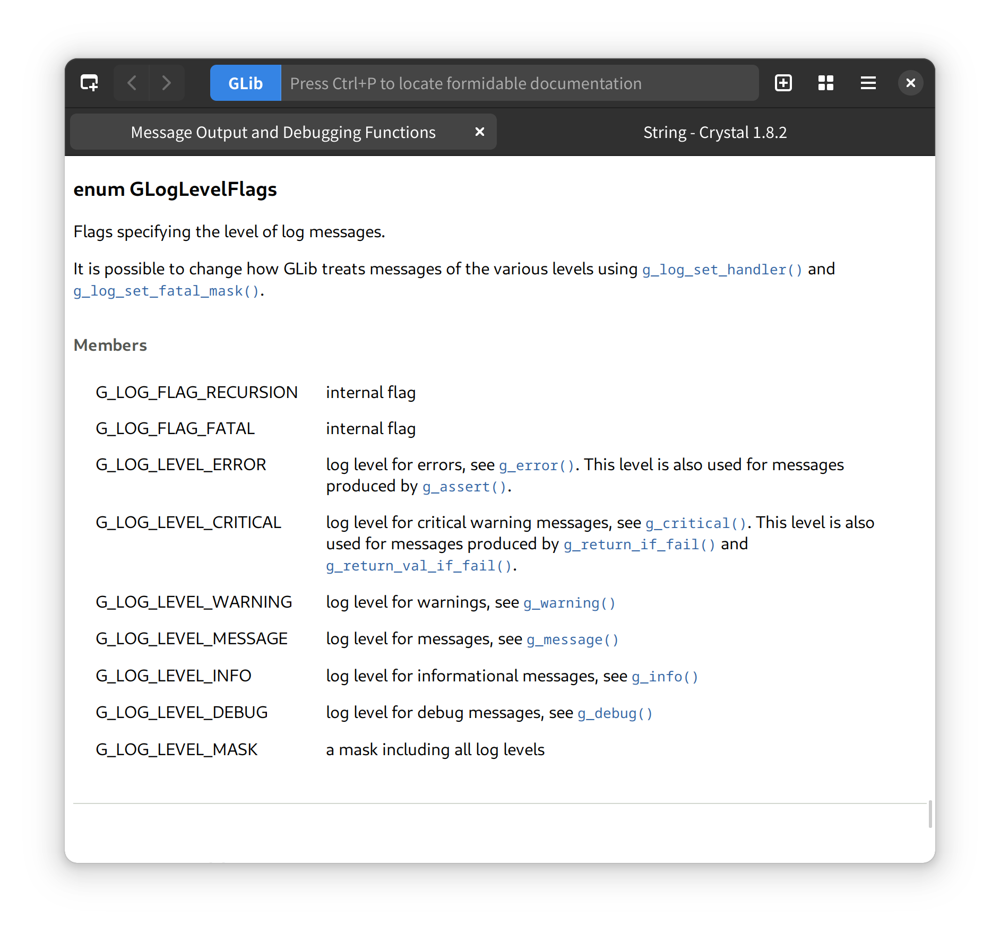

# Read the Formidable Manual

It's a dash/docset reader with built in documentation for Crystal and GTK
APIs. It's written in [Crystal](https://crystal-lang.org/) using
[GTK4 bindings](https://github.com/hugopl/gtk4.cr).



Tasks needed to be done before I ask anyone to use this:

- [x] Create better Crystal docset files.
- [x] Base UI defined and implemented.
- [x] Create docset reader/indexer.
- [x] Docset chooser widget.
- [ ] Add UI to download docset.
- [x] Fuzzy search and show docset results.
- [ ] Have button/shortcut to enable/disable fuzzy search.
- [x] Open docset by double click it.
- [x] Add back/foward buttons.
- [x] Save session.
- [ ] Page search.
- [x] Tabs memorize theirs docsets.
- [x] Fix scrollbar to be always on top after search results change.
- [x] Initial welcome page.
- [x] About dialog.
- [ ] Focus webpage after open a doc page.
- [x] Have screenshots in this README.
- [x] Create GTK docsets based on offline GTK docs + ~GIR info.~.
- [x] Archlinux AUR package.
- [ ] Ubuntu package.

## Installation

## ArchLinux

There's a AUR package, it's named `gnome-rtfm` because there's already a `rtfm` package there for another project.

```
yay -S gnome-rtfm
```

## Ubuntu

Waiting for you to submit a package 😉️.

## Flatpack

Waiting for you to submit a package 😉️.

## Compiling from source

Dependencies:

- [Crystal compiler](https://github.com/crystal-lang/crystal).
- [Shards dependency manager](https://github.com/crystal-lang/shards).
- [SQLite3](https://sqlite.org/index.html).
- [GTK4](https://www.gtk.org/)
- [GTK Webkit-6.0](https://webkitgtk.org/)
- [GObject-introspection](https://gi.readthedocs.io/en/latest/) packages for all GTK related dependencies.
- Offline crystal api documentation for Crystal docset generation.
- Offline Gtk api documentation for Gtk4, Gdk4, Gsk4, libAdwaita and Pango libraries for GTK4 libraries docset generation.

There are no packages for any distro yet.

```
$ make
$ make install
```

Then you need to run some commands to let Gnome Shell update the application cache and start show Rtfm, but
if you don't remember these commands, just reinstall some Gnome application like gnome-calculator and it's done 😅️.

You can uninstall it later with:

```
$ make uninstall
```

## Contributing

1. Fork it (<https://github.com/hugopl/rtfm/fork>)
2. Create your feature branch (`git checkout -b my-new-feature`)
3. Commit your changes (`git commit -am 'Add some feature'`)
4. Push to the branch (`git push origin my-new-feature`)
5. Create a new Pull Request

## Contributors

- [Hugo Parente Lima](https://github.com/hugopl) - creator and maintainer
